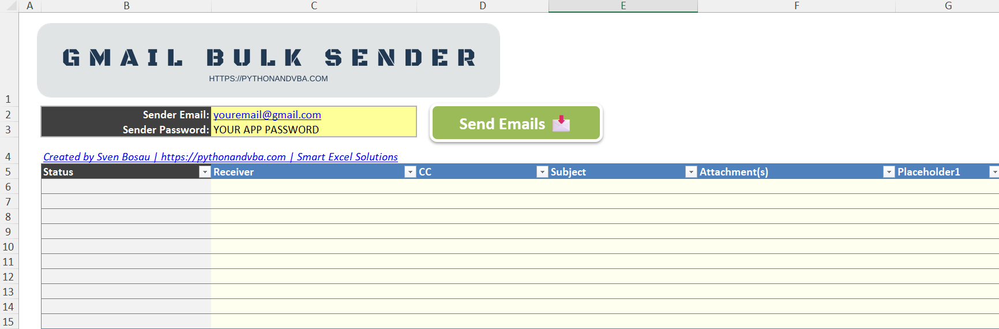

# Excel Gmail Bulk Sender with Python 📧

This tool lets you send personalized bulk emails directly from Excel using Python and Gmail. It's perfect for automating email campaigns, sending reports, or any task that involves reaching multiple recipients efficiently.



## Features
- Send emails to multiple recipients with just one click.
- Include CC, attachments, and placeholders for personalized content.
- Fully customizable email content from Excel.

## Installation
1. **Install Python**:
   - Make sure Python is installed on your system. You can download it from [python.org](https://www.python.org/downloads/).

2. **Install Required Libraries**:
   - Open a terminal or command prompt and run:
     ```bash
     pip install xlwings
     ```

3. **Enable Macros in Excel**:
   - This tool uses Excel macros for interaction with Python. Ensure that macros are enabled in your Excel settings.

4. **Set Up Gmail App Password**:
   - For security, Gmail requires an app password instead of your regular password.
   - Follow this [tutorial](https://docs.pythonandvba.com/gmail-blaster/guides/setting-up-an-app-password-in-gmail) to create your app password.

## Usage
1. Open the Excel file.
2. Fill in the **Sender Email** and **App Password** in the `SEND_LIST` sheet.
3. Add recipients, email content, and attachments in the `SEND_LIST` sheet.
4. Write your email body in the `EMAIL_BODY` sheet.
5. Click the **Send Emails** button to start sending!


## Video Tutorial (Coming soon!)
[](https://youtu.be/XXX)


## 🤝 Connect with Me
- 📺 **YouTube:** [CodingIsFun](https://youtube.com/c/CodingIsFun)
- 🌐 **Website:** [PythonAndVBA](https://pythonandvba.com)
- 💬 **Discord:** [Join the Community](https://pythonandvba.com/discord)
- 💼 **LinkedIn:** [Sven Bosau](https://www.linkedin.com/in/sven-bosau/)
- 📸 **Instagram:** [sven_bosau](https://www.instagram.com/sven_bosau/)

## Support 
If you find my tutorials helpful, consider [supporting my work](https://pythonandvba.com/coffee-donation).
[](https://pythonandvba.com/coffee-donation)

## Feedback & Collaboration
For feedback, suggestions, or potential collaboration opportunities, reach out at contact@pythonandvba.com.

